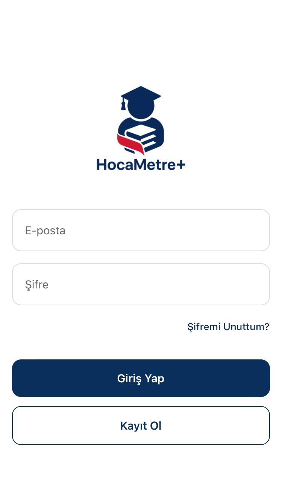
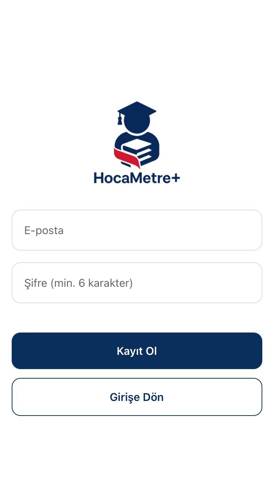
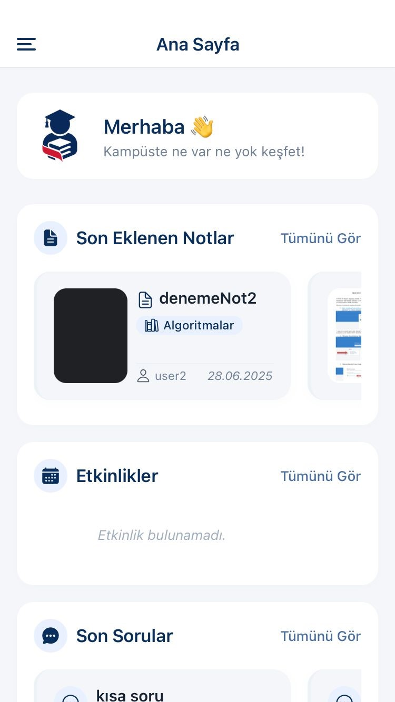
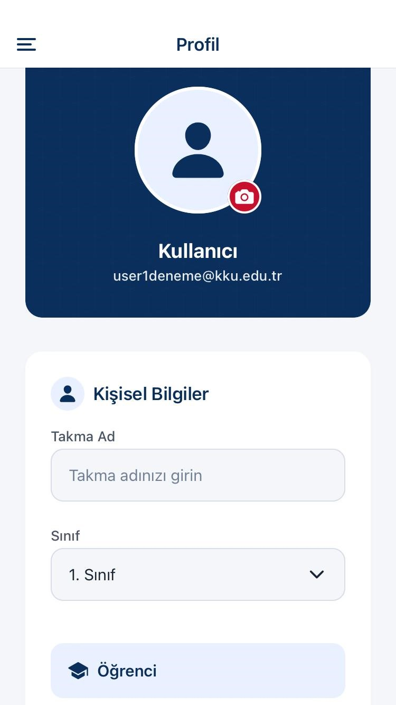
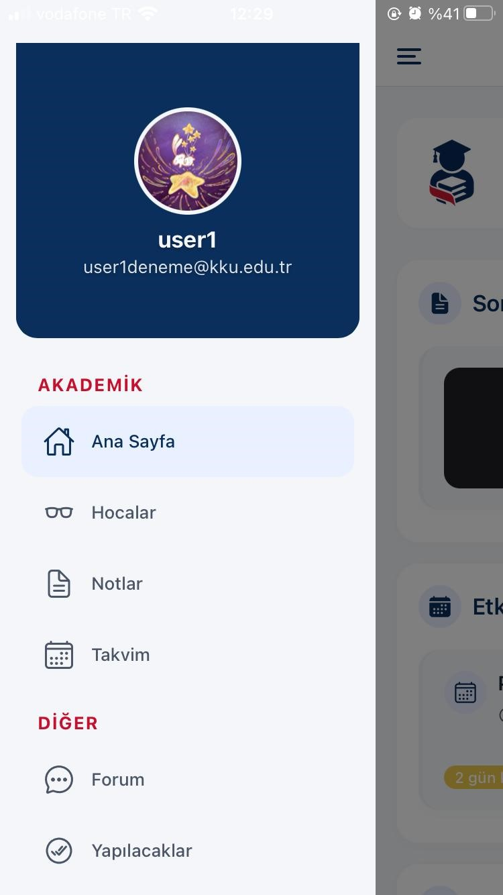
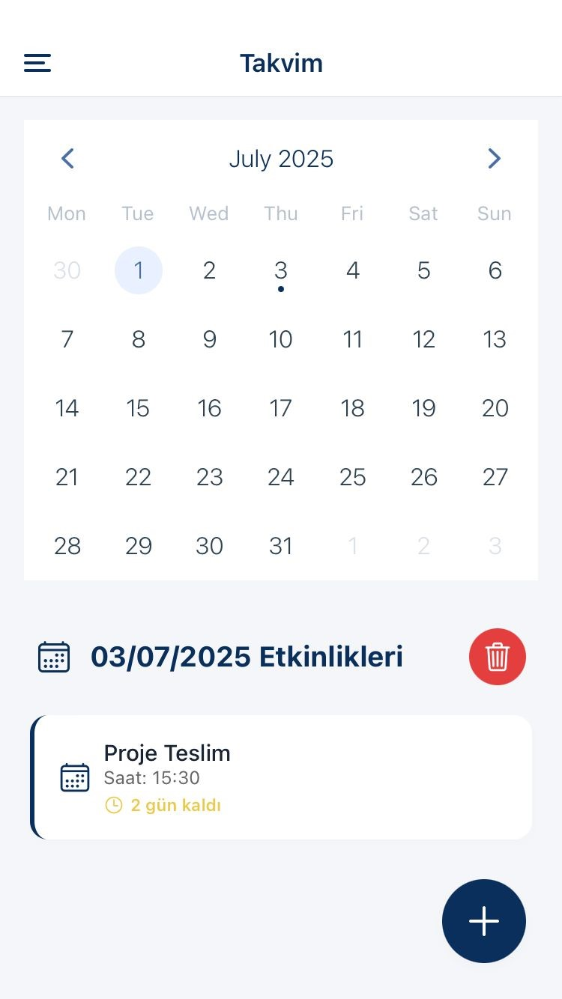
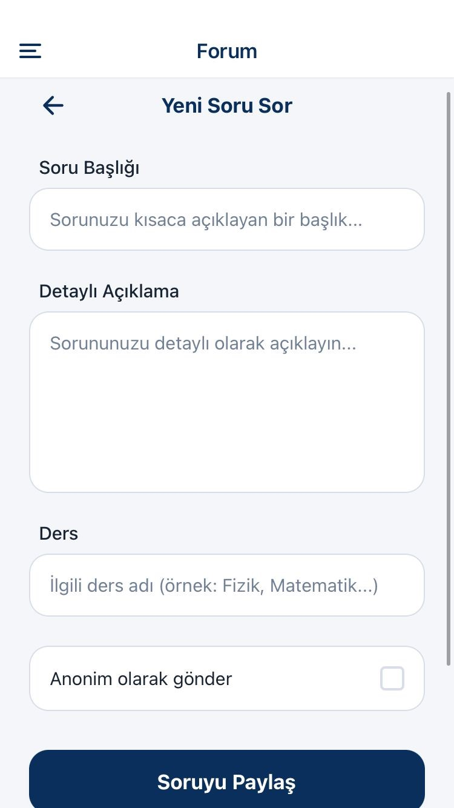
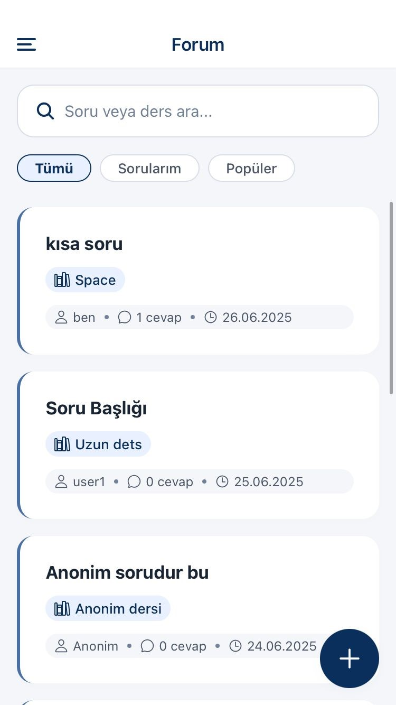
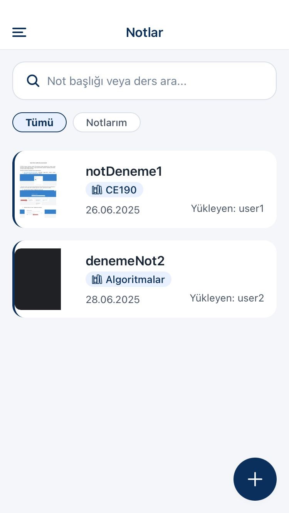

# HocaMetre+

HocaMetre+, öğrencilerin dersleri yönetebilmesi, öğretmenlerle iletişim kurabıldığı, forumda soru sorabileceği ve notlarını tutabileceği kapsamlı bir eğitim yönetim uygulamasıdır.

## Özellikler

- **Kimlik Doğrulama**: Güvenli giriş ve kayıt sistemi
- **Takvim**: Dersleri ve etkinlikleri yönetme
- **Forum**: Soru sorma ve cevaplandırma
- **Notlar**: Ders notlarını kaydetme ve düzenleme
- **Yapılacaklar**: Günlük görevleri takip etme
- **Öğretmenler**: Öğretmen profilleri ve iletişim
- **Profil Yönetimi**: Kullanıcı profili düzenleme
- **Bulut Depolama**: Cloudinary ile görsel yükleme
- **Gerçek Zamanlı Veri**: Firebase ile senkronizasyon

## Screenshots

Uygulamanın çeşitli ekran görüntüleri aşağıda yer almaktadır:

### Giriş ve Kayıt Ekranları




### Ana Ekranlar





### Özellik Ekranları







## Teknoloji Stack

- **Framework**: React Native (Expo)
- **Dil**: TypeScript
- **Backend**: Firebase
- **Görsel Yönetimi**: Cloudinary
- **Navigation**: React Navigation
- **Veri Takvimi**: react-native-calendars
- **Stil**: React Native StyleSheet

## Kurulum

### Gereksinimler

- Node.js (v16 veya üstü)
- npm veya yarn
- Expo Go uygulaması (cihazda test için önerilir)

### Adımlar

1. Depoyu klonlayın:

```bash
git clone <repo-url>
cd hocametre-plus
```

2. Bağımlılıkları yükleyin:

```bash
npm install
# veya
yarn install
```

3. Ortam değişkenlerini ayarlayın:
   `.env.example` dosyasını kopyalayarak `.env` oluşturun:

```bash
# macOS/Linux:
cp .env.example .env

# Windows:
copy .env.example .env
```

Sonra `.env` dosyasını kendi değerlerinizle doldurun:

```env
EXPO_PUBLIC_FIREBASE_API_KEY=YOUR_KEY_HERE
EXPO_PUBLIC_FIREBASE_AUTH_DOMAIN=YOUR_DOMAIN_HERE
EXPO_PUBLIC_FIREBASE_PROJECT_ID=YOUR_PROJECT_ID_HERE
EXPO_PUBLIC_FIREBASE_STORAGE_BUCKET=YOUR_BUCKET_HERE
EXPO_PUBLIC_FIREBASE_MESSAGING_SENDER_ID=YOUR_SENDER_ID_HERE
EXPO_PUBLIC_FIREBASE_APP_ID=YOUR_APP_ID_HERE
EXPO_PUBLIC_CLOUDINARY_CLOUD_NAME=YOUR_CLOUD_NAME_HERE
EXPO_PUBLIC_CLOUDINARY_UPLOAD_PRESET=YOUR_UPLOAD_PRESET_HERE
```

**Not**: `.env` dosyası `.gitignore`'a eklenmiştir ve hassas bilgiler version control'e kaydedilmez.

4. Uygulamayı başlatın:

**Geliştirme sunucusu:**

```bash
npx expo start
```

Telefonda çalıştırmak için Expo Go uygulamasını açıp QR kodu tarayın.

**Doğrudan platform:**

```bash
npx expo start --android
npx expo start --ios
npx expo start --web
```

## Proje Yapısı

```
src/
├── screens/          # Uygulama ekranları
│   ├── auth/         # Kimlik doğrulama ekranları
│   ├── calendar/     # Takvim ekranları
│   ├── forum/        # Forum ekranları
│   ├── home/         # Ana sayfa
│   ├── notes/        # Not ekranları
│   ├── profile/      # Profil ekranları
│   ├── teachers/     # Öğretmen ekranları
│   └── todos/        # Yapılacaklar ekranları
├── navigation/       # Navigasyon yapılandırması
├── services/         # API ve hizmetler
│   ├── firebase/     # Firebase entegrasyonu
│   └── cloudinary/   # Cloudinary entegrasyonu
├── context/          # React Context
├── utils/            # Yardımcı fonksiyonlar
└── theme.ts          # Tema ve renkler
```

## Önemli Dosyalar

- [package.json](package.json) - Proje bağımlılıkları
- [app.json](app.json) - Expo yapılandırması
- [tsconfig.json](tsconfig.json) - TypeScript yapılandırması
- [metro.config.js](metro.config.js) - Metro bundler yapılandırması

## Firebase Yapılandırması

Firebase hizmetleri `.env` dosyasındaki ortam değişkenlerinden otomatik olarak yüklenir. Yapılandırma detayları [src/services/firebase/firebase.ts](src/services/firebase/firebase.ts) dosyasında bulunur.

Ortam değişkenleri `process.env.EXPO_PUBLIC_*` ile erişilebilir ve Expo tarafından otomatik olarak tanınır.

## Bulut Depolama

Görsel yüklemeleri için Cloudinary kullanılır. [src/services/cloudinary/cloudinaryService.ts](src/services/cloudinary/cloudinaryService.ts) dosyasında yapılandırma yapılır.

## Geliştirme

### TypeScript Kontrolü

```bash
tsc --noEmit
```

### Projeyi Derleme

```bash
npm start
```
